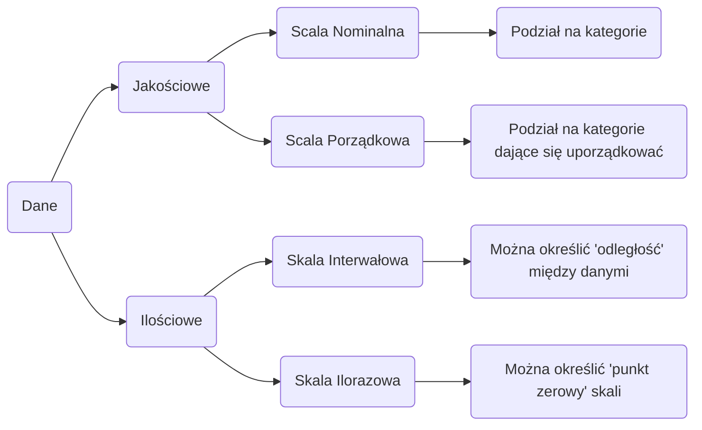
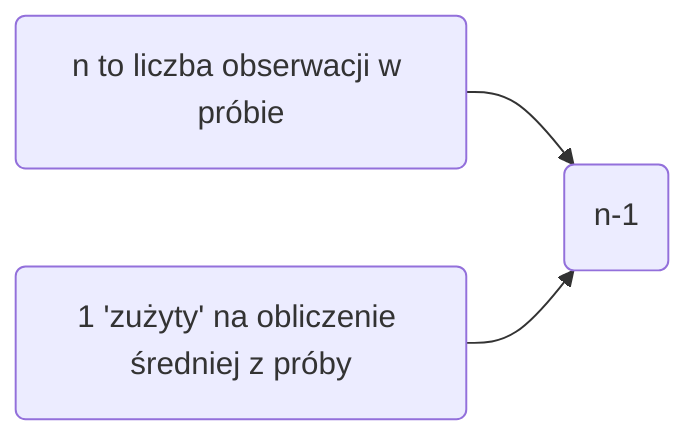

# Statystyka Opisowa

## Statystyka
Statystyka ma za zadanie w miarę możliwości ==precyzyjnie== wnioskować o populacji na podstawie badania próby

## Populacja
==Populacja== jest pojmowana jako zbiór wyników wszystkich pomiarów, którymi badacz jest zainteresowany. Populację nazywa się też ==uniwersum==. 

## Próba
==Próba== jest podzbiorem wyników pomiarów wybranych z populacji. Pobierania próby dokonuje się z reguły w sposób ==losowy==, tj. w taki sposób, żeby każda możliwa próba złożona z n elementów miała taką samą szansę, że zostanie wybrana. Tak wybraną próbę nazywa się prostą próbą losową lub krócej ==próbą losową==.

## Klasyfikacja danych

*rysunek z klasyfikacji danych

## Skale pomiarowe

### Skala nominalna 
Przy ==nominalnej skali pomiarowej== liczby są używane tylko jako etykiety dla grup (klas). Jeżeli zbór danych składa się z obiektów niebieskich, zielonych i czerwonych, możemy oznaczyć obiekty niebieskie numerem 1, zielone numerem 2, a czerwone numerem 3. Cyfry 1, 2 i 3 zastępują tylko nazwę klasy, do której należy obiekt. Nominalną skalę pomiarową stosujemy do wyników obserwacji, które mają charakter raczej jakościowy" niż „ilościowy": do zbioru obiektów niebieskich, zielonych i czerwonych, do zbioru mężczyzn i kobiet, do grup zawodowych, do zbioru obiektów geograficznych, itp.

#### Tabela 1. Przykład: Dane jakościowe/skala nominalna 
Grupa krwi | Liczba pacjentów | Udział % 
-------------|-----------------------|--------
A | 425 | 39.5%
B | 180 | 16.7%
AB | 84 | 7.8%
0 | 388 | 36%
Razem | 1077 | 100.0%

---

### Skala porządkowa 
Przy ==porządkowej skali pomiarowej== wyniki obserwacji obiektów mogą być uporządkowane w zależności od ich rozmiarów lub znaczenia. Cztery produkty możemy oceniać za pomocą cyfr 1, 2, 3, 4, gdzie 1 oznacza najlepszy, a 4 najgorszy. Przy takiej skali pomiarowej nie dowiadujemy się niczego o tym, o ile jeden produkt jest lepszy od drugiego, wiemy tylko, że jest lepszy.

#### Tabela 2. Przykład: Dane jakościowe/skala porządkowa

Stan migdałków | Liczba dzieci | Udział % 
-------------|-----------------------|--------
niepowiększone | 516 | 36.9%
powiększone | 589 | 42.1%
bardzo powiększone | 293 | 21.0%
Razem | 1398 | 100.0%

---

### Skala przedziałowa (interwałowa) 
Przy ==przedziałowej skali pomiarowej== umiemy przypisać znaczenie różnicy między wynikami obserwacji obiektów. Wyniki obserwacji są umieszczone w pewnym przedziale liczbowym, odległością między obiektami jest różnica między wynikami obserwacji, wyrażona w odpowiednich jednostkach. Na przykład przeciętna wartość indeksu Dow Jones w styczniu 1992 r. wynosiła 3108, a w grudniu 1991 r. 2914. Różnica między styczniem a grudniem wyniosła 94 jednostki. To są liczby ze skali przedziałowej.

---

### Skala ilorazowa 
==Ilorazowa skala pomiarowa== jest **"najmocniejszą"** ze wszystkich skal. W tym przypadku znaczenie ma nie tylko odległość między dwoma obserwowanymi obiektami. Znaczenie możemy przypisać również ilorazom odległości. Na przykład płace mierzymy na skali florazowej. Płaca 50000 $ jest dwa razy większa niż płaca 25 000 $. Podobnego porównania nie możemy zrobić w odniesieniu do temperatury, mierzonej w skali przedziałowej. Nie możemy powiedzieć, że obiekt o temperaturze 50° Celsjusza jest dwa razy cieplejszy od obiektu o temperaturze 25° Celsjusza. Skala ilorazowa musi zawierać naturalne zero. (0° Celsjusza nie jest takim zerem). Odróżnienie skali przedziałowej od ilorazowej nie zawsze jest łatwe.

----

#### Grupowanie danych ilościowych 
Klasa wydatków ($) | Częstość (liczba klientów) f(x) | Względna częstość f(x)
------|-----------|--------
Od 0 do mniej niż 100 | 30 | 0,163
Od 100 do mniej niż 200 | 38 | 0,207
Od 200 do mniej niż 300 | 50 | 0.272
Od 300 do mniej niż 400 | 31 | 0,168 
Od 400 do mniej niż 500 | 22 | 0,120 
Od 500 do mniej niż 600 | 13 | 0,070
- | 184 | 1,000

Grupę danych, których wartości mieszczą się w granicach jednego z ustalonych przez nas przedziałów, nazywamy ==klasą==.

## Percentyle, kwartyle, mediana

==P-tym percentylem== w zbiorze liczb (uporządkowanych według wielkości) jest taka wartość, poniżej której znajduje się P% liczb z tego zbioru. Miejsce P-tego percentyla określa wzór: 
$$
(n+1)P/100
$$
 gdzie n jest liczbą elementów zbioru³.

==Pierwszy kwartyl== to 25-ty percentyl, czyli wartość, poniżej której znajduje się jedna czwarta wyników obserwacji. 
Podobnie ==drugim kwartylem== jest 50-ty percentyl, który obliczyliśmy w przykładzie: jest to najważniejszy kwartyl, mający specjalną nazwę: mediana. 

==Mediana== jest to 50-ty percentyl, czyli wartość, poniżej której znajduje się połowa obserwacji.

==Trzeci kwartyl== to 75-ty percentyl, czyli wartość, poniżej której znajduje się trzy czwarte wyników obserwacji. 

25-ty percentyl jest często nazywany ==kwartylem dolnym==, 50-ty percentyl, czyli mediana - ==kwartylem środkowym==, a 75-ty percentyl - ==kwartylem górnym==.

## Miary tendencji centralnej 
==Dominantą== w zbiorze danych jest ta wartość, która w tym zbiorze występuje najczęściej.

==Średnią== zbioru wyników obserwacji, zwaną także ==przeciętną==, jest suma wartości wszystkich wyników podzielona przez liczbę elementów tego zbioru. 

Miarą tendencji centralnej jest także poznana wcześniej ==mediana==.

---

**Średnia w próbie:**
$$
\overline{x}=\frac{\sum_{i=1}^{n} x_{i}}{n}=\frac{x_1+...+x_n}{n},
$$
gdzie $\sum$ jest znakiem sumowania. Sumowanie rozciąga się na wszystkie wyniki obserwacji.

**Średnia w populacji:**
$$
\mu=\frac{\sum_{i=1}^{N} {}x_i}{N}.
$$

## Miary rozrzutu 

### Zmienności 
==Rozstępem== w zbiorze wyników obserwacji nazywamy różnicę między największą i najmniejszą zaobserwowaną wartością. 

==Odstępem międzykwartylowym== nazywamy różnicę między trzecim (górnym) a pierwszym (dolnym) kwartylem. 

==Wariancją== w zbiorze wyników obserwacji nazywamy przeciętne kwadratowe odchylenie poszczególnych wyników do ich średniej.

---

**Wariancja w próbie:**
$$
s^2=\frac{\sum_{i=1}^{n} {(x_i-\overline{x})^2}}{n-1}.
$$

**Wariancja w populacji:**
$$
\sigma^2=\frac{\sum_{i=1}^{N} {(x_i-\mu)^2}}{N},
$$
gdzie $\mu$ jest średnią w populacji.

--------
### Stopnie swobody
$Oszacowanie~wariancji= \frac{suma~kwadratów~odchyleń~od~pewnej~wartości}{liczba~stopni~swobody}$

$$
s^2=\frac{\sum_{i=0}^{n} {(x_i-\overline{x})^2}}{n-1}.
$$

---

### Zmienności
==Odchyleniem standardowym== w zbiorze wyników obserwacji nazywamy (dodatni) pierwiastek kwadratowy z wariancji.

**Odchylenie standardowe w próbie:**
$$
s=\sqrt{s^2}=\sqrt{\frac{\sum_{i=1}^{N} {(x_i-\overline{x})^2}}{n-1}}.
$$

**Odchylenie standardowe w populacji:**
$$
\sigma=\sqrt{\sigma^2}=\sqrt{\frac{\sum_{i=1}^{N} {(x_i-\mu)^2}}{N}}
$$

---

### Współczynnik zmienności
Współczynnik zmienności określamy jako iloraz odchylenia
standardowego przez średnią:
$$
c_v=\frac{s}{\overline{x}}
$$

## Grupowanie danych i histogramy

==Histogram== jest wykresem utworzonym ze słupków o różnej wysokości. Wysokość słupka reprezentuje częstość, z jaką pojawiły się wyniki obserwacji należące do klasy reprezentowanej przez słupek. Sąsiednie słupki mają wspólne boki. 

==Względną częstością==, odpowiadającą danej klasie, jest liczba wyników obserwacji należących do tej klasy (liczebność klasy) podzielona przez liczbę wszystkich obserwacji.

### Miary tendencji centralnej dla danych zgrupowanych

#### Moda (dominanta):
$$
D\cong x_0+l\frac{n_d-n_{d-1}}{(n_d-n_{d-1})+(n_d-n_{d+1})}
$$
$x_0$ – dolna granica przedziału klasowego mody
$l$ – szerokość przedziału klasowego mody
$n_d$ – liczebność w przedziale mody
$n_{d-1}$ – liczebność w przedziale poprzedzającym przedział mody
$n_{d+1}$ – liczebność w przedziale następującym po przedziale mody

---

#### Mediana:
$$
M_e \cong x_0 + \frac{l}{n_0}(N_{M_e}-N^*)
$$
$x_0$ – dolna granica przedziału klasowego mediany
$l$ – szerokość przedziału klasowego mediany
$n_0$ – liczebność w przedziale mediany
$N_{M_e}$ – numer obserwacji, której wartość jest medianą
$N^*$ – skumulowana liczba obserwacji do klasy mediany (bez klasy mediany)

---

#### Średnia pogrupowanych wyników obserwacji:
$$
\overline{x}=\frac{\sum_{i=1}^{k} {f_im_i}}{n}.
$$

#### Wariancja pogrupowanych wyników obserwacji:
$$
s^2=\frac{\sum_{i=1}^{k} {f_i(m_i)^2}-\frac{(\sum_{i=1}^{k} {f_im_i})^2}{n}}{n-1}.
$$

gdzie:
$f_i$ – liczebność i-tego przedziału klasowego,
$m_i$ – środek i-tego przedziału klasowego

---
### Skośność rozkładu

### Spłaszczenie rozkładu
Miarą spłaszczenia rozkładu częstości (które przeciwstawiamy spiczas- tości) jest kurtoza.

## Związki między średnią a odchyleniem standardowym

### Twierdzenie Czebyszewa

 Dowiedzione przez Czebyszewa twierdzenie prowadzi do następujących reguł: 
 1. Co najmniej 3/4 wyników obserwacji odchyla się od średniej o mniej niż o 2 odchylenia standardowe. 
 2. Co najmniej 8/9 wyników obserwacji odchyla się od średniej o mniej niż o 3 odchylenia standardowe. 

	Te reguły są szczególnym przypadkiem reguły stwierdzającej, że co najmniej (1-1/k²)-ta część wyników obserwacji odchyla się od średniej o mniej niż o k odchyleń standardowych. (Zauważmy, że k nie musi być liczbą całkowitą).

Reguła empiryczna Gdy rozkład wyników obserwacji ma kształt kopca, tj. gdy histogram odpowiadający da- nym jest dosyć symetryczny i jednomodalny, znajdują zastosowanie dokładniejsze reguły: 1. Około 68% wyników obserwacji odchyla się od średniej nie więcej niż o 1 odchylenie standardowe. 2. Około 95% wyników obserwacji odchyla się od średniej nie więcej niż o 2 odchylenia standardowe. 3. Ogromna większość wyników obserwacji (wszystkie lub prawie wszystkie) odchyla się od średniej nie więcej niż o 3 odchylenia standardowe

---

### Reguła empiryczna 

Gdy rozkład wyników obserwacji ma kształt kopca, tj. gdy histogram odpowiadający da- nym jest dosyć symetryczny i jednomodalny, znajdują zastosowanie dokładniejsze reguły: 
1. Około 68% wyników obserwacji odchyla się od średniej nie więcej niż o 1 odchylenie standardowe. 
2. Około 95% wyników obserwacji odchyla się od średniej nie więcej niż o 2 odchylenia standardowe. 
3. Ogromna większość wyników obserwacji (wszystkie lub prawie wszystkie) odchyla się od średniej nie więcej niż o 3 odchylenia standardowe

# Prawdopodobieństwo całkowite

## Użyteczne wzory związane z prawdopodobieństwem całkowitym:
### Przypadek dwuczłonowego podziału zbioru $B$:
$$
P(A)=P(A|B)P(B)+P(A|\overline{B})P(\overline{B}).
$$
### Przypadek n-członowego podziału zbioru $B$ na zbiory $B_1,...,B_n$:
$$
P(A)=\sum_{i=1}^{n} {P(A|B_i)P(B_i)}.
$$

## Twierdzenie Bayesa
### Twierdzenie Bayesa:
$$
P(B|A)=\frac{P(A|B)P(B)}{P(A|B)P(B)+P(A|\overline{B})P(\overline{B})}.
$$
### Uogólnione twierdzenie Bayesa:
$$
P(B_1|A)=\frac{P(A|B_1)P(B_1)}{\sum_{i=1}^{n} {P(A|B_i)P(B_i)}}
$$

# Dyskretne zmienne losowe
## Skokowe (dyskretne) zmienne losowe
* ==Zmienną losową== jest zmienna, która przyjmuje różne wartości liczbowe, wyznaczone przez los. 

* Zmienna losowa jest ==skokowa (dyskretna)==, gdy może przyjmować wartości ze zbioru najwyżej przeliczalnego. 
* Zmienna losowa ==ciągła== może przyjmować wartości z dowolnego przedziału liczbowego. Możliwe wartości takiej zmiennej tworzą zbiór nieprzeliczalnie nieskończony.
### Rozkład prawdopodobieństwa skokowej zmiennej losowej

Rozkład prawdopodobieństwa skokowej zmiennej losowej X spełnia następujące warunki:
$$
P(x) ≥0~dla~wszystkich~wartości~x.
$$
$$
\sum_{wszystkie~x}^{} {P(x)}=1.
$$

### Dystrybuanta skokowej zmiennej losowej

==Skumulowaną funkcją rozkładu (dystrybuanta)== skokowej zmiennej losowej X jest funkcja:
$$
F(x)=P(X \leq x) = \sum_{wszystkie~i\leq x}^{} {P(i)}.
$$

### Wartość oczekiwana skokowej zmiennej losowej

==Oczekiwana wartość== skokowej zmiennej losowej X jest równa sumie wszystkich możliwych wartości tej zmiennej mnożonych przez ich praw- dopodobieństwa:
$$
\mu=E(X)=\sum_{wszystkie~x}^{} {xP(x)}.
$$

